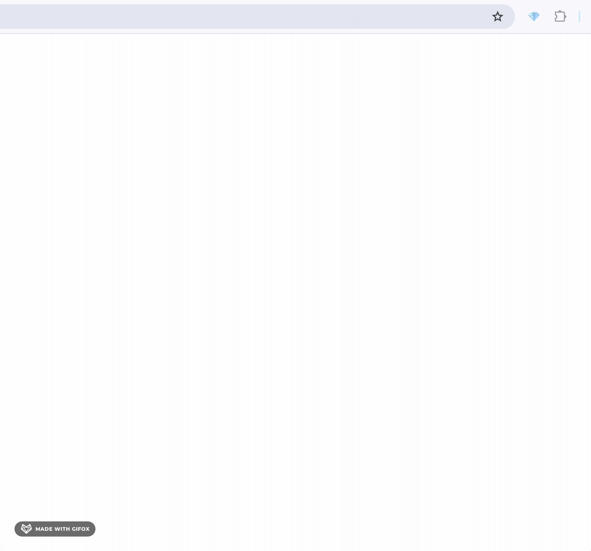

# TON Address Converter Extension

A Chrome extension that allows you to convert TON blockchain addresses between different formats.

Vibe-coded with [Cursor](https://cursor.com/) and very little JS knowledge.

## Features

- Convert between raw, and user-friendly formats of TON addresses
- Auto-focus input field on popup open, just press ⌘V/Ctrl+V to paste your address
- Copy converted addresses to clipboard with a single click on 📋 button

## Installation

1. Download or clone this repository
2. Open Chrome and navigate to `chrome://extensions/`
3. Enable "Developer mode" in the top-right corner
4. Click "Load unpacked" and select the directory containing this extension
5. The extension icon (💎) should appear in your browser toolbar

## Usage

1. Click on the extension icon in your browser toolbar or use the keyboard shortcut (⇧⌘K)
2. Enter a TON address in any format
3. The extension will automatically convert it to other formats
4. Click on any converted address to copy it to your clipboard

## License

MIT 